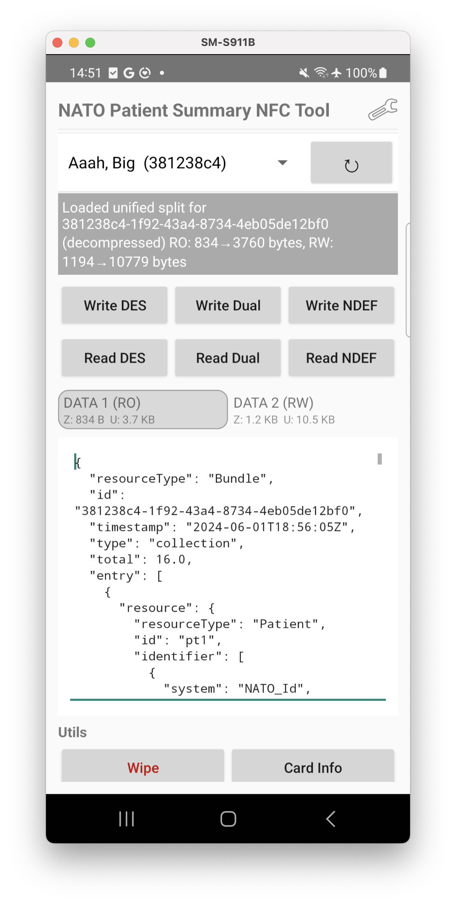

# NATO Patient Summary NFC Android App

  
   
  <em>Patient data shown is fictitious</em>

This Android application is a demonstration and reference implementation for writing and reading NATO Patient Summary (NPS) data to MIFARE DESFire EV1/EV2/EV3 NFC cards using several interoperable approaches.

It accompanies the IPS MERN WebApp and demonstrates how NATO-aligned patient summaries can be stored on NFC media in a way that balances:

Universal readability (standard NDEF)

Controlled mutability (read-only vs read/write)

DESFire-grade security and structure

Offline usability

## Key Features
### 🔹 Three NFC Storage Modes

The app supports three distinct NFC layouts, selectable from the UI:

### 1️⃣ Pure DESFire (App 665544)

- Stores two binary blobs in a private DESFire application
- Fully DESFire-native (not visible to standard NDEF readers)
- Read/write access controlled via DESFire keys
- Useful for controlled environments and testing

### 2️⃣ Dual Mode (Type-4 NDEF + DESFire)

- Read-only NATO Patient Summary stored as standard Type-4 NDEF
- Visible to any NFC reader (Android, iOS, desktop)
- Read/write “extra” data stored in a private DESFire app
- Demonstrates a pragmatic hybrid approach

### 3️⃣ NDEF Mode (Two NDEF files in App 000001)

- Fully aligned with the proposed NLD NPS DESFire layout
- A single NDEF application (000001) containing:
- File E104 – NPS (read-only)
- File E105 – Extra data (read/write)
- CC file contains two NDEF File Control TLVs
- Vanilla NDEF readers see only the NPS
- Advanced apps can read/write the extra file using DESFire commands

## WebApp Integration

The app integrates with the IPS MERN WebApp to fetch patient data.

### Supported backends

- http://localhost:5049 (via adb reverse)
- https://ipsmern-dep.azurewebsites.net (All patient data shown is fictitious)

### Record Identifier Protection
- 0 = None
- 1 = Encrypted (field-level)
- 2 = Identifiers replaced with "omitted"

A Settings button (⚙️) allows switching between backends and protection levels at runtime.

### Workflow

1. Fetch list of IPS records (UUID, given name, family name)

2. Select a patient from a dropdown

3. Fetch a split IPS bundle:

   - RO section → resources ≤ timestamp
   - RW section → resources > timestamp

4. Populate the two text areas automatically

5. Write to NFC card using one of the supported modes

## Android UI Overview

- Patient selector (Spinner)

- Action buttons

  - Write / Read DESFire
  - Write / Read Dual
  - Write / Read NDEF

- Tabbed payload view

- Read-only (Historic / NPS)

- Read/Write (Extra data)

- Formatting buttons
    - DESFire format
    - Dual format
    - NDEF format

- Status bar showing operation results and card info

## NFC Card Requirements

- MIFARE DESFire EV1 / EV2 / EV3
- 8KB or 16KB variants recommended
- Android device with NFC and IsoDep support

## Technical Highlights
### DESFire Details

- Uses IsoDep + native DESFire commands
- Explicit creation of:
   - Applications
   - Standard data files
   - ISO file IDs (E103, E104, E105)
- File sizes are validated before write
  - Writes fail cleanly if data exceeds capacity
- Read-only enforced via DESFire access rights

### NDEF Handling
- Manual construction of NDEF records
- Supports short and long records
- Correct handling of:
  - NLEN
  - MIME media types
  - CC file TLVs
- Avoids Android’s “greedy” NDEF formatting pitfalls

## Project Structure (Key Classes)

| Class          | Purpose                                                  |
|----------------|----------------------------------------------------------|
| MainActivity   | UI, NFC intent handling, workflow coordination           |
| DesfireHelper  | Pure DESFire read/write implementation                   |
| NDEFHelper     | Dual mode (Type-4 NDEF + DESFire)                        |
| NATOHelper     | NATO-compliant two-NDEF-file implementation              |
| PayloadBuilder | DESFire command payload construction                     |

## Development & Testing Notes
### Local testing
<pre>adb reverse tcp:5049 tcp:5049</pre>

Then select Local in the app’s Settings menu.

### Dependencies
- nfcjlib
- okhttp
- AndroidX / AppCompat
- Kotlin

No Compose UI is required for the NFC functionality.

### Design Intent

This app is not a consumer product.

It is intended as:
- A reference implementation
- A standards exploration tool
- A proof-of-concept for NATO-style patient summaries on NFC
- A practical companion to backend IPS/NPS experimentation

### Limitations & Notes
- Standard Android/iOS NDEF APIs will only read the first NDEF file
- Access to secondary NDEF files requires DESFire-level commands
- Cryptographic protection (JWE / omit) is handled by the backend, not the card

# License & Usage
This code is provided for demonstration, research, and interoperability testing purposes.
Security parameters, keys, and formats must be reviewed before any operational use.
